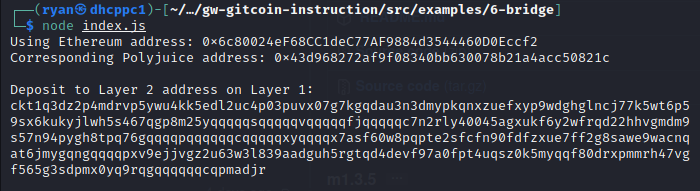

1)A screenshot of the console output immediately after you have successfully generated your Deposit Receiver Address.

2)Your Deposit Receiver Address (in text format).
```
ckt1q3dz2p4mdrvp5ywu4kk5edl2uc4p03puvx07g7kgqdau3n3dmypkqnxzuefxyp9wdghglncj77k5wt6p59sx6kukyjlwh5s467qgp8m25yqqqqqsqqqqqvqqqqqfjqqqqqc7n2rly40045agxukf6y2wfrqd22hhvgmdm9s57n94pygh8tpq76gqqqqpqqqqqqcqqqqqxyqqqqx7asf60w8pqpte2sfcfn90fdfzxue7ff2g8sawe9wacnqat6jmygqngqqqqpxv9ejjvgz2u63w3l839aadguh5rgtqd4devf97a0fpt4uqsz0k5myqqf80drxpmmrh47vgf565g3sdpmx0yq9rqgqqqqqqcqpmadjr
```
3)The Ethereum address used to generate the Deposit Receiver Address (in text format).
```
0x6c80024eF68CC1deC77AF9884d3544460D0Eccf2
```
4)A link to the Etherscan explorer for the successful Force Bridge transaction. This can be found on Force Bridge under History→Succeed.
```
https://rinkeby.etherscan.io/tx/0x1873ee1a664515da450cd178e00027d3914ca93d07cc1fa5228b4b6283e2b832
```
5)A link to the Nervos explorer for the successful Force bridge transaction. This can be found on Force Bridge under History→Succeed.
```
https://explorer.nervos.org/aggron/transaction/0xd0f5fbd16332004cf72d18067210c8649249872676585a4e499edce43900cf01
```
